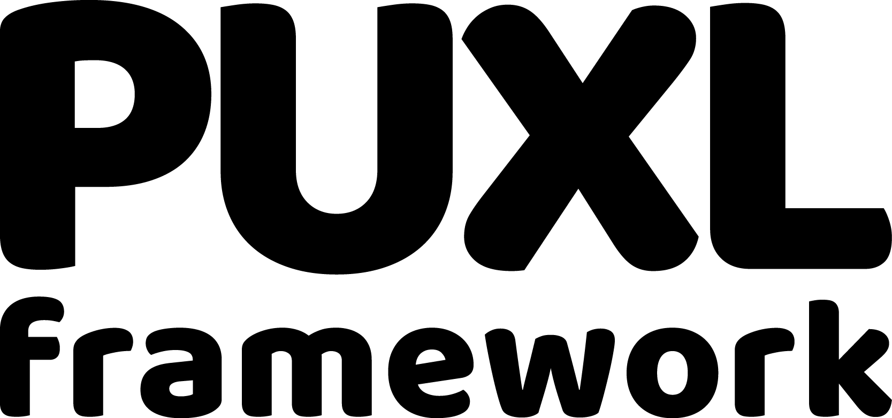
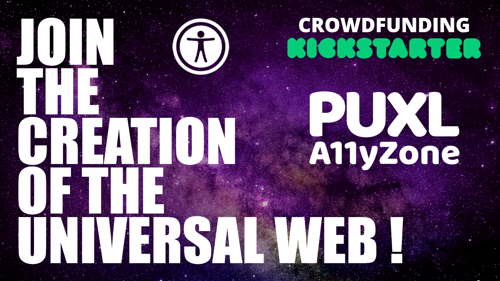
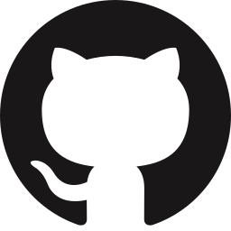
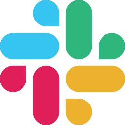

# PUXL framework
  

  **PUXL** (ˈpʌksl) is an accessibility-first, eco-friendly open source front-end library for the modern Web. It helps you create accessible, responsive Web User Interfaces with lightweight HTML.  

  [Check out the Docs (v1-βeta)](https://puxl.github.io/puxl.io/docs/v1-beta/)

---
## Crowdfunding
  

  <a href="https://puxlaccessibility.zone/">Collaborate here!</a>

---

## Table of Contents 

  - [Introduction](#Introduction)  
  - [Contributing](#Contributing)  
  - [Team](#Team)  
  - [Support](#Support)  
  - [Credits and Thanks](#Credits-and-Thanks)  
  - [Copyright and license](#Copyright-and-license)  

---

## Introduction
  PUXL framework was created with the aim of helping developers to create accessible, modern, robust and optimized web interfaces, using many techniques, one of them is the minification and optimization of the HTML, JS and CSS code of any development process with the PUXL framework.

---

## Contributing

  - Sharing
  - Coding
  - <a href="https://puxlaccessibility.zone/">Crowdfunding</a>

---

## Team

  | Iñigo Garcia | The PUXL Clan |  
  | :---: |:---:|  
  |  |  |  
  | Human. Designer. Creator and co-founder of @PUXL_framework. | PUXL Team |  
  |   |      |

  PUXL is created by [@MrKanuel](https://twitter.com/mrkanuel), and brought by [The PUXL Clan](https://twitter.com/i/lists/1123508090614239232/members) with love from Basque Country.

---

## Support

  Contact us at one of the following places!
  
  <a href="https://www.youtube.com/channel/UCKf093lz3NY-JZRvh-JGwdA"> Watch our videos on Youtube!</a>  
  
  <a href="https://www.facebook.com/puxla11y/"> Puxl's Facebook</a>  
  
  <a href="https://twitter.com/puxla11y"> Puxl's Twitter</a>  
  
  <a href="https://www.linkedin.com/company/puxl/"> Puxl's Linkedin</a>  
  
  <a href="https://puxlframework.slack.com/join/shared_invite/zt-6wuia0nl-2DUSBgjwYRwWH9yVviAosQ#/"> Puxl's Slack</a>  

---

## Credits and Thanks

  Thanks everyone for knowledge, dedication, hard work and inspiration.  
  This project stands on the shoulders of giants.

  This application uses Open Source components. You can find the source code of their open source projects along with license information below.  
  Thank you very much and a big applause to these creators for their contributions to open source. They helped this project happen.  

  We would like to thank a lot of people, organizations and initiatives, big and small around the globe for making their contributions to the open accessible Web. You are so many we had to make a [Thanks file](readme/thanks.md)!

---

## Copyright and license

  Code released under [the General Public License V-3 (GPL3)](LICENSE.md).  
  Docs released under [Creative Commons BY-SA 4.0](https://creativecommons.org/licenses/by-sa/4.0/).
